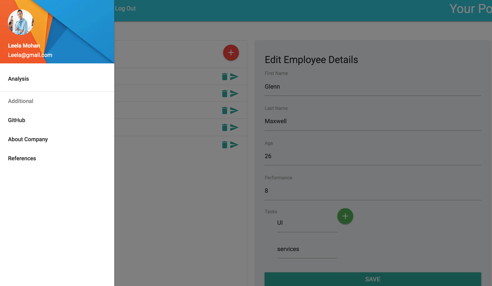
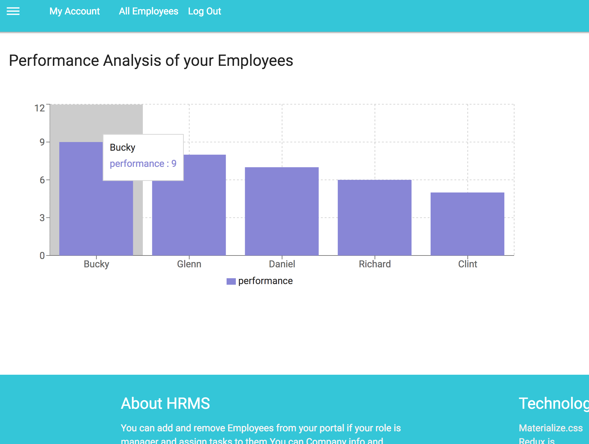
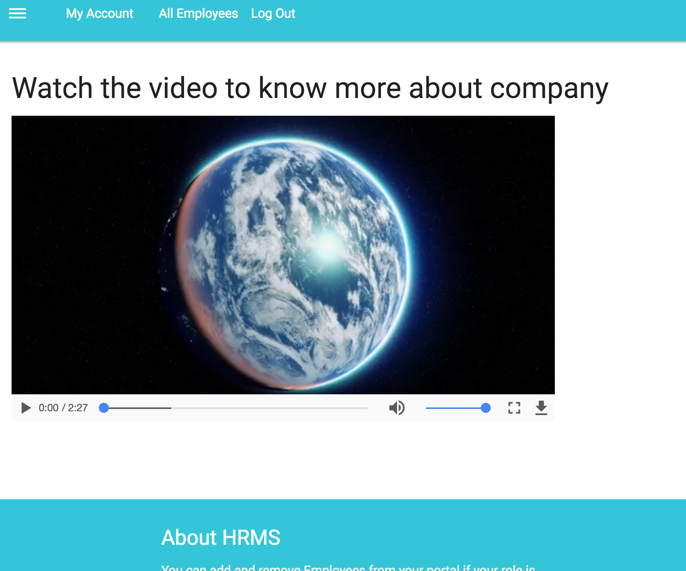

## React-HRMS
React-HRMS is a simple HRMS application using __[React](https://reactjs.org/)__, __[Redux](https://redux.js.org/)__ and __[Node.js](https://nodejs.org/en/)__ as backend

## Setup And Usage
follow these steps
    
     //To Start the UI Server
     cd react-hrms
     npm install
     npm start

    //To start the Backend Server
    cd backend
    npm install
    npm start

## What is React-HRMS
This app is a simple Human Resource Managemnt System .You can be logged in as Manager or as an normal employee
with M11 or M12 as id and 'pass' as password.

If you are logged in as Manager 
+ You can add,edit,delete employees and assign tasks to them
+ You can analyse the performance of employees through chart
+ You can view the details of company using streaming video

## ScreenShots

## Features
+ __[Jsonwebtoken](https://jwt.io//)__ used for Security in the backend
+ Video Streaming
+ __[Materialise.css](http://materializecss.com/)__ for Styling
+ Node.js and __[Express](https://expressjs.com/)__ in the Backend
+ __[React-Redux](https://github.com/reactjs/react-redux/)__ for State Management
+ __[Recharts](http://recharts.org/)__ for charts

